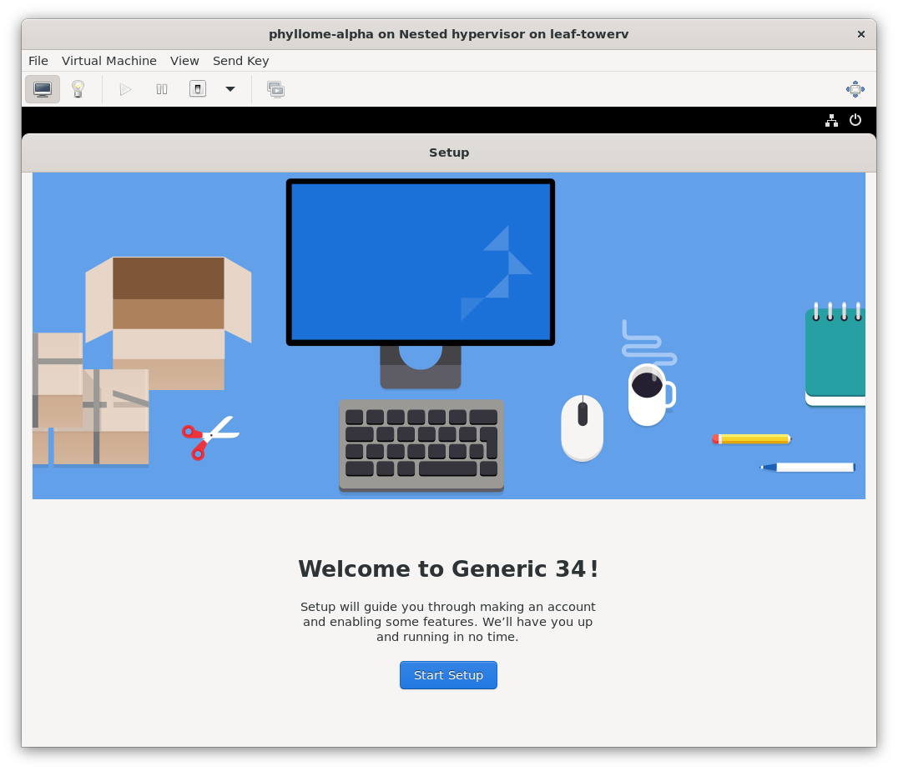
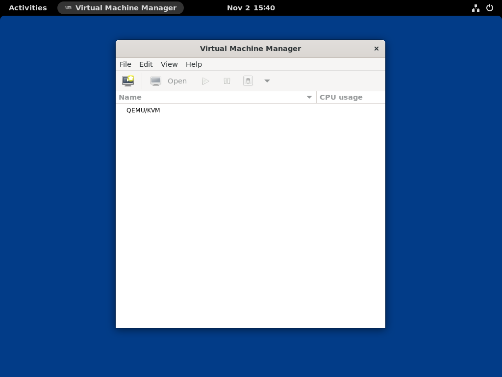

# Phyllome OS

> *Virtualization for the rest of us*

This is the **alpha version** of Phyllome OS. Expect bugs and disappointment.

> External contributions to Phyllome OS are welcome. Have a look [here](https://kanboard.phyllo.me/b/CH7qd98J2v7egmodk/development) for some ideas on what to do next, or feel free to create a GitHub issue and suggest an idea you wish to work on. Also, it might be good to skim through the [white-paper](https://files.phyllo.me/s/oYwfxYpZcbppwr6) to understand what it is about and what the project is trying to achieve.

*Phyllome OS is a [Fedora Remix](https://fedoraproject.org/wiki/Remix) based on [Fedora Server 35](https://getfedora.org/en/server/) designed to leverage hardware-assisted virtualization and paravirtualization to make it easier to run modern guest operating systems locally.*

## What is on the menu or the content of this repository

This repository contains snippets of code for the [multiple versions](https://wiki.phyllo.me/deploy/rightforyou#phyllome-os-versions) of Phyllome OS, and also a handful of other operating systems artefacts. 

Each version of Phyllome OS is like a ***dish*** that is based on a ***recipe*** that contains ***ingredients***. Dishes are stand-alone kickstart files. Kickstart files are used to automate the installation and configuration of RPM-based operating systems such as Phyllome OS, just as a recipe and its instructions can be used to create a dish.

* `ingredients`🥑 🥥 🥭 🥝 🥦 🥬 🥒 🧄...: this directory contains the basic building blocks, or ingredients, for assembling Phyllome OS and other derivatives.
    * Each ingredient represents a feature or a set of integrated features, such as a Desktop Environment. Not all ingredients will end up in the final product, but that is okay to try and add new flavors!
    * Feel free to add new ingredients here, such as another Desktop Environment or a new set of software. 
* `recipes`🧾 🧩: this directory contains recipes, which are made of ingredients listed in a specific order.
    * Everyone is free to create a new recipe based on new or existing ingredients.
* `dishes`🥨 🥐 🥖 🥧 🥞 🥯 🧆 🧁...: this directory contains the end-product in the form of stand-alone and ready-to-consume kickstart files, just like cooked dishes.
    * When a new ingredient ends up in a dish, it should be tested before being committed to the repository. The total number of official dishes should not exceed a handful, to avoid the burden of testing too many dishes.
* `post-first-startup-scripts` : this directory contains scripts that are meant to be run manually by the user after a successful installation. This is like the topping of a dish.
    * These code snippets will eventually be included inside existing building blocks, summoned as a systemd unit after a successful installation, or turned into RPM-packages.
* `img` : this directory contains screenshots of Phyllome OS used in the README file.

*Developping Phyllome OS should feel like creating a new dish! 👩🏽‍🍳 🧑🏿‍🍳 *

## How to hack Phyllome OS

This readme contains contains the instructions to deploy Phyllome OS Desktop locally, inside a virtual machine, using a local kickstart file. 

> If you would like to install Phyllome OS on your computer instead, as a replacement of your current operating system, please follow [this guide](https://wiki.phyllo.me/deploy/prepare) instead.

As of now, hacking kickstart files is the main way to develop Phyllome OS. 

Have a look [here](https://docs.fedoraproject.org/en-US/fedora/rawhide/install-guide/appendixes/Kickstart_Syntax_Reference/) to learn the kickstart syntax. You can also study the official kickstart for all Fedora versions [here](https://pagure.io/fedora-kickstarts/tree/main). 

### Requirements

> Only Linux-based development is possible at the moment. Support for macOS and Windows-based development will follow.

* A Linux distribution, with a recent Linux Kernel (> 5.X)
* An x86_64 platform with hardware-assisted virtualization enabled. 
    * Follow [this guide](https://wiki.phyllo.me/deploy/prepare#enable-hardware-assisted-virtualization) to learn how to activate hardware-assisted virtualization on a supported platform.
* Nested-virtualization enabled (optional but better to have)
* `virt-install` and `virt-manager`, as well as `libvirt` and `qemu-kvm` up and running

#### Enable nested-virtualization 

* **Enable** nested-virtualization on **AMD-based systems**, then reboot:

```
sudo echo "options kvm_amd nested=1" >> /etc/modprobe.d/kvm.conf
```

* Verify that nested-virtualization is activated, using the following command, which should return a `1`: 

```
cat /sys/module/kvm_amd/parameters/nested    
1
```

**Enable** nested-virtualization on **Intel-based systems**, then reboot:

```
sudo echo "options kvm_intel nested=1" >> /etc/modprobe.d/kvm.conf`
```

* Verify that nested-virtualization is activated, using the following command, which should return a `1`: 

```
cat /sys/module/kvm_intel/parameters/nested    
1
```

#### Install the prerequisites on Fedora 35

```
sudo dnf install -y qemu-kvm libvirt libvirt-daemon-config-network libvirt-daemon-kvm virt-install virt-top virt-manager libguestfs-tools python3-libguestfs guestfs-tools pykickstart
```

#### Install the prerequisites on Ubuntu 20.4 or Debian 11

```To be done```

### Hack around

Clone this repository:

```
git clone https://github.com/PhyllomeOS/PhyllomeOS.git
```

Modify some files, typically inside the `ingredients` directory, using your favorite editor.

Then, merge the kickstart basic building blocks or ingredients of the recipe into a single file, or dish. This process is called 'flattening'.

```
ksflatten -c virtual-desktop-hypervisor.cfg -o ../dishes/virtual-phyllome-desktop.cfg
```

> If any errors are detected, go back and fix them.

When you are done, move to the `dishes` directory:

```
cd ../dishes
```

### Fire it up!

The following command will read your flattened file and use it to automatically bootstrap your modified revision of Phyllome OS on a virtual machine with 2 vCPUs, 4 GB of RAM and a disk of 5 GB.

> Adjust it according to your need.

```
sudo virt-install \
    --connect qemu:///system \
    --metadata description="Phyllome OS Desktop, generic edition" \
    --os-variant detect=off \
    --virt-type kvm \
    --arch x86_64 \
    --machine q35 \
    --name virtual-phyllome-desktop \
    --boot uefi \
    --cpu host-model,topology.sockets=1,topology.cores=2,topology.threads=1 \
    --vcpus 2 \
    --memory 4096 \
    --video virtio \
    --graphics spice,listen=none \
    --channel spicevmc \
    --autoconsole none \
    --console pty,target.type=virtio \
    --sound none \
    --network type=user,model=virtio \
    --controller type=virtio-serial \
    --controller type=usb,model=none \
    --controller type=scsi,model=virtio-scsi \
    --input type=keyboard,bus=virtio \
    --input type=tablet,bus=virtio \
    --rng /dev/urandom,model=virtio \
    --disk path=~/.local/share/libvirt/images/virtual-phyllome-desktop.img,format=raw,bus=virtio,cache=writeback,size=5 \
    --location=https://download.fedoraproject.org/pub/fedora/linux/releases/35/Everything/x86_64/os/ \
    --initrd-inject virtual-phyllome-desktop.cfg --extra-args "inst.ks=file:virtual-phyllome-desktop.cfg"
```

You should see the following message: 
```
Starting install...
Retrieving file vmlinuz...                                  |  10 MB  00:00     
Retrieving file initrd.img...                               |  79 MB  00:02     
Allocating 'virtinst-inlu7cmw-vmlinuz'                      |  10 MB  00:00     
Transferring virtinst-inlu7cmw-vmlinuz                      |  10 MB  00:00     
Allocating 'virtinst-2dd8ghse-initrd.img'                   |  79 MB  00:00     
Transferring virtinst-2dd8ghse-initrd.img                   |  79 MB  00:01     
Allocating 'virtual-phyllome-desktop.img'                   | 5.0 GB  00:00     

Domain is still running. Installation may be in progress.
You can reconnect to the console to complete the installation process.
```
The installation process will be launched behind the scenes. You can open `virt-manager` and connect to the virtual machine console to follow the process. Eventually, you will be greeted with this screen:



After you are done setting up your user account, `virt-manager` will automatically start:



If the installation is successful and your feature is working as intended, you are welcome to create a pull request. Thank you!

## Phyllome OS 

Phyllome OS goal is to maximize ease-of-use and compatibility. As such, it intends to become the easiest way to use modern operating systems locally, in a virtual machine, by integrating pertinent open-source software such as `libvirt`, `qemu-kvm` (and eventually `Cloud Hypervisor`), as well as `virt-manager`.

Users should not have to manage Phyllome OS: they should be able to pick their favorite operating system and Phyllome OS should run it, no questions asked.

> Note : expect for open-source [Darwin derivatives](https://en.wikipedia.org/wiki/Darwin_(operating_system)#Derived_projects), Phyllome OS **strongly** discourages users from running proprietary, darwin-based derivatives on non-Apple hardware.

### The Phyllome OS Project

The Phyllome OS Project relies on multiple tools, including the following public-facing tools: 

* **Wiki**: Take a look at the [wiki repository](https://github.com/PhyllomeOS/wiki) for more information on how you can contribute to improving the documentation.
* **Issues tracker**: a public, read-only issue tracking is [available online](https://kanboard.phyllo.me/b/CH7qd98J2v7egmodk/development). From now on, GitHub issue tracking will be used to track development-only issues.  
* **Code repository**: GitHub is used to host the code, with a mirror pointing to git.phyllo.me

> The Phyllome OS Project is **looking for core contributors**, willing to contribute regularly to the project. If you are interested in making cutting-edge open-source virtualization more accessible, please send a message to contact@phyllo.me. 

## License

* [MIT](./LICENSE.md) for the most part, alongside [GPL](./blocks-live/LICENSE.md) licensed code.

## Acknowledgement

Thanks to the main contributors of the official Fedora kickstart files repository, and related tools:

> Adam Miller, Bastien Nocera, Bruno Wolff III, Bryan Kearney, Chitlesh Goorah, Christoph Wickert, 
Colin Walters, Fabian Affolter, Igor Pires Soares, Jens Petersen, Jeremy Katz, Jeroen van Meeuwen
Jesse Keating, Luya Tshimbalanga, Matthias Clasen, Pedro Silva, Rahul Sundaram, Sebastian Dziallas
Sebastian Vahl, wart. More information here : https://pagure.io/fedora-kickstarts
